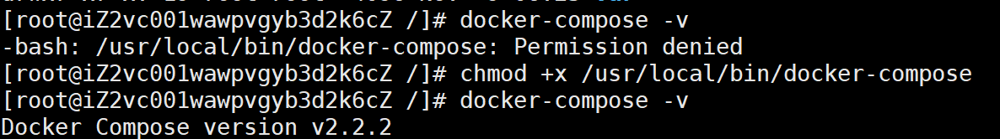

# Docker

仅记录分享部分常用，更多请见<a href='https://docs.docker.com/get-started/overview/' target='_blank'>Docker官方文档</a>

## docker安装

### Centos 7


卸载docker旧版本

```shell
yum remove docker docker-client docker-client-latest docker-common docker-latest docker-latest-logrotate docker-logrotate docker-selinux docker-engine-selinux docker-engine
```

安装相关工具类

```sh
yum install -y yum-utils device-mapper-persistent-data lvm2
```

配置docker仓库

```shell
yum-config-manager --add-repo https://download.docker.com/linux/centos/docker-ce.repo
```

aliyun的源

```shell
yum-config-manager --add-repo http://mirrors.aliyun.com/docker-ce/linux/centos/docker-ce.repo
```

安装docker

```shell
yum install docker-ce
```

检验docker安装成功，成功展示出版本号即成功

```shell
docker -v
```

启动docker

```shell
systemctl start docker
```

验证docker

```shell
docker run hello-world
```


设置开机自启

```csharp
chkconfig docker on
```

升级docker ce

```undefined
yum -y upgrade
```

卸载docker ce 

```shell
yum remove docker-ce
rm -rf /var/lib/docker
```


配置163镜像与存储目录（更快速）

```shell
vim /etc/docker/daemon.json
```

registry-mirrors 为镜像地址

docker 版本<20 graph 为存储目录 建议不要使用默认的 否则空间会不够用

docker 版本>20 graph已经弃用 需使用 data-root

```shell
{
  "registry-mirrors": ["http://hub-mirror.c.163.com"],
  "data-root": "/home/docker"
}
```

配置完成后重启

```shell
systemctl daemon-reload
systemctl restart docker
```


### Windows

下载docker-desktop即可


## docker-compose安装

### 从github下载

[Release v2.2.2 · docker/compose · GitHub](https://github.com/docker/compose/releases/tag/v2.2.2)

选用2.2.2版本，其他版本自行从releases中选择下载即可

下载完成后，上传到 `/usr/local/bin` 中，并重命名为`docker-compose`

此时直接执行`docker-compose -v`会提示没有权限，需要授权

```shell
chmod +x /usr/local/bin/docker-compose
```


这个时候执行版本检查即可

