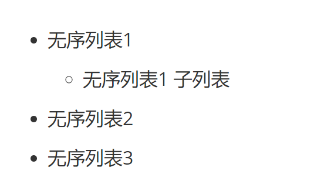

# Markdown 学习

## 背景

无论是使用<a href="https://hexo.io/zh-cn/" target="_blank">Hexo</a>、<a href="https://gohugo.io/" target="_blank">Hugo</a>或是<a href="https://www.jekyll.com.cn/" target="_blank">Jekyll</a>搭建自己的博客写博文，还是用来编写文档，markdown语法的使用必不可少。 在本地可以下载 <a href="https://typoraio.cn/" target="_blank">Typora</a> — 一款支持markdown(md) 语法的编辑器， 可以更快速、更效率的编写md文档，这里就不过多介绍。  但如果是想在github 直接进行文档编写，那最好是要熟悉一下md语法。

另外，如果需要编写docx \ pdf 文档， 也可以使用markdown， 在编写完成后用插件转换即可。


**以下是正题**


---


## 语法

### 文本

#### 标题

可以看到本文的一些标题，就是用md语法实现的

- Typora中快捷键  `Ctrl`  `1` `2` `3` `4` `5` `6`  为对应的标题 

- 示例代码

```markdown
# 这是一级标题
## 这是二级标题
### 这是三级标题
#### 这是四级标题
##### 这是五级标题
###### 这是六级标题
```

​	当然你也可以使用html，得到的效果是一样的

```html
<h1>这是一级标题</h1>
<h2>这是一级标题</h2>
<h3>这是一级标题</h3>
<h4>这是一级标题</h4>
<h5>这是一级标题</h5>
<h6>这是一级标题</h6>
```

- 效果如下

  

#### 字体

- 加粗

  - 说明：在文本两侧加 **；Typora快捷键： `Ctrl`  `B`

  - 示例代码 

    ```markdown
    **我变粗了**
    ```

- 斜体

  - 说明：在文本两侧加 *，Typora快捷键： `Ctrl`  `I`

  - 示例代码 

    ```markdown
    *我变斜了*
    ```

- 斜体加粗

  - 说明：在文本两侧加 ***

  - 示例代码 

    ```markdown
    ***我又斜又粗***
    ```

- 删除

  - 说明：在文本两侧加 ~~ ；快捷键： `Alt` `Shift` `5`  

  - 示例代码 

    ~~~~
    ~~我被删除了~~
    ~~~~

- 效果如下

  **我变粗了**

  *我变斜了*

  ***我又粗又斜***

  ~~我被删除了~~
  
  

#### 段落

- 说明： 使用空格分隔一行或多行文本


#### 换行

- 说明： 使用 `<br>` ，或者在结尾使用两个空格或多个空格结束一行


### 代码

#### 单行代码

- 说明 见代码

- 代码

  ```markdown
  使用 `` 引用起来
  如 `abc`
  ```

- 效果

  `abc`

   


#### 代码块

- 说明 使用 ``` 加任意可识别的编程语言

- 示例代码

  ```markdown
  ​```java
  	public static void main(String[] args) {
  		System.out.println("Hello Peilin");
  	}
  ​```
  ```

  ```markdown
  ​```javascript
      function hello() {
      	console.log("Hello Peilin")
      }
  ​```
  ```

  

- 效果

  ```java
  public static void main(String[] args) {
      System.out.println("Hello Peilin");
  }
  ```

  ```javascript
  function hello() {
      console.log("Hello Peilin")
  }
  ```


### 分割线

- 说明：使用 三个以上的 - 或者 三个以上的 *

- 代码

  ```markdown
  ***
  ****
  ---
  ----
  ```

  

### 图片

- 说明

  其中 图片alt 为图片不能展示时展示的内容； url为图片的路径，可以是相对路径、绝对路径、网络路径； 图片名称为鼠标悬浮图片上展示内容

- 代码

  ```markdown
  
  
  如
  	
  
  
  其中 图片alt 为图片不能展示时展示的内容； url为图片的路径，可以是相对路径、绝对路径、网络路径
  ```

- 效果如下


### 列表

- 无序列表

  - 说明：在行首，使用 `-` `*` `+` 任意一个加空格 `space` ，接文本即可； 若想成为下一级，则在行首加Tab或者3个空格

  - 代码

    ```markdown
    - 无序列表1
    	- 无序列表1 子列表
    * 无序列表2
    + 无序列表3
    ```

  - 效果

    


- 有序列表

  - 说明：在行首 使用`数字` `.` `space` 接文本即可

  - 代码

    ```markdown
    1. 列表内容
    2. 列表内容
    3. 列表内容
    ```

  - 效果

    1. 列表内容
    2. 列表内容
    3. 列表内容


### 表格

- 说明： 直接见代码

- 代码

  ```markdown
  name | age | gender
  --|:--:|--:
  pipi | 4 | male
  hanhan | 2 | male
  
  :-- 左对齐
  --: 右对齐
  :--: 居中对齐
  ```

- 效果

  | name   | age  | gender |
  | ------ | ---- | ------ |
  | pipi   | 4    | male   |
  | hanhan | 2    | male   |


### 链接

- 代码

  ```markdown
  [名称](地址)
  
  如
  
  [百度](https://www.baidu.com)
  ```

  [百度](https://www.baidu.com)


- 说明

  通过上述方式创建的链接是页面内跳转。 如果想实现点击打开新标签页，则需要使用html a标签，具体代码如下

  ```html
  <a href="https://www.baidu.com" target="_blank">百度</a>
  ```

  <a href="https://www.baidu.com" target="_blank">百度</a>


### 转义

- 说明： 在Markdown语法中有许多字符都表示着不同的功能，如果想使用原本字符，直接加 \ 在该字符之前进行转义即可。 比如你想用 - 字符， 结果发现 - 加 空格就变成了无序列表，此时直接  \\- 即可。  


### 脚标

- 代码

```markdown
[^标注文本]:
```

- 效果

[^标注文本]:这是标注文本


### 区块

- 在段落开头引用 > 符号然后跟一个空格

- ```markdown
  > 区块引用
  > Text ABC
  >> 使用多个 > 嵌套
  ```

- 效果

  > 区块引用
  >
  > Text ABC

  > > 使用多个 > 嵌套


---


## 其他

在markdown中， 同样可以使用html进行替代，但就编写文档而言，markdown语法更加精炼简洁，功能上也基本够用。 当然就像<u>链接</u>一样，可能有的功能达不到你的需求，这时候使用html可能就能满足你的需求。   


markdown转pdf / word 可以使用typora的自带导出功能。 也可以使用<a href="https://pandoc.org/" target="_blank">Pandoc</a>


---


欢迎补充指正，

以上。

By Peilin

--- ***Life Oriented Programming*** ---


